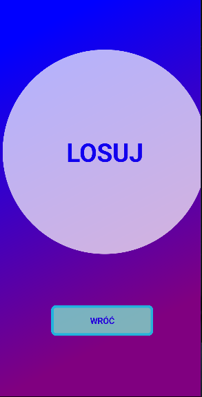

# Goofy Soundboard
Goofy Soundboard to aplikacja mobilna, która odtwarza memiczne dźwięki. 
Aplikacja ta została napisana w środowisu xamarin.forms na android. 
Do odtwarzania dźwięków używa wtyczki SimpleAudioPlayer. 
# Krótka prezentacja
## Strona Główna 
 
## Dźwięki 
 
## Losowanie 
 
file.name 
 
